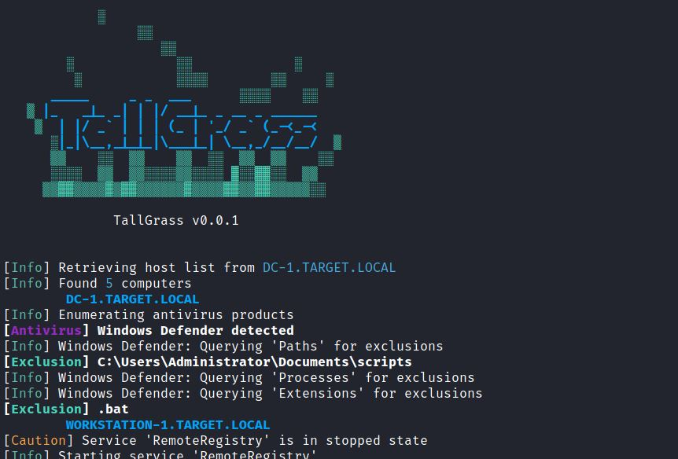

# TallGrass

#### A Python script that enumerates supported antiviruses and their exclusions on Windows hosts within a domain.

## __Description__



Some antiviruses, like Windows Defender, expose their exclusions through the registry. Because of this, it is possible, and somewhat trivial, to enumerate them for potential means of AV evasion. 

TallGrass queries the domain controller for all domain-joined Windows hosts, then enumerates the AV exclusions for each host.

Additionally, TallGrass uses the 'RemoteRegistry' service to access the host registry. If the service is disabled or stopped, the script will start it to access the registry, then return it to it's original state.

Although Microsoft [recently patched](https://www.bitdefender.com/blog/hotforsecurity/microsoft-patches-defender-flaw-that-lets-attackers-dodge-antivirus-scans/) the ability for normal users to view the registry exclusions, TallGrass requires administrative privileges to access the registry remotely, which still allows access to the exclusions.

## __Usage__

### __Getting Started__

In the TallGrass directory, run the following to install the required dependencies.

```
pip3 install -r requirements.txt
```

Once installed, TallGrass should be good to go. See help message for CLI usage.

```
usage: tallgrass.py [-h] -u USERNAME -d DC FQDN [-n LMHASH:NTHASH] [-p PASSWORD]

Windows domain AV exclusion enumeration.

optional arguments:
  -h, --help        show this help message and exit

required arguments:
  -u USERNAME       Domain username
  -d DC FQDN        Target Domain Controller FQDN, I.E. dc-1.example.local

authentication:
  -n LMHASH:NTHASH  NTLM hashes, format is LMHASH:NTHASH
  -p PASSWORD       Cleartext password

```

### __Considerations__

- Remote, privileged access to hosts is required. If the 'RemoteRegistry' service is disabled or not started, accessing remote services must be enabled.

- For simplicity, TallGrass doesn't have an option to target a specific host.

- Currently, only Windows Defender and Microsoft Security Essentials are supported. Other AVs that maintain readible exclusions in the registry can be added relatively easily.

 ---

### __Versions__

__0.0.1:__

- Initial release

### __References__

- [Impacket](https://github.com/SecureAuthCorp/impacket) - Impacket is a collection of Python classes for working with network protocols. _Credit to Impacket and SecureAuth (in addition to the reg.py + netview.py examples) for having the open source resources to make this script possible._

- [Bleepin Computer](https://www.bleepingcomputer.com/news/security/microsoft-defender-weakness-lets-hackers-bypass-malware-detection/) - Microsoft Defender weakness lets hackers bypass malware detection (Patched - Feb 2022)

### __Disclaimer__

This open source project is meant to be used with explicit authorization from any entity it affects (perceived or actual). This programs use in conjunction with offensive security tools should only take place in an approved assessment of an organization's security or for authorized research. Misuse of this software is not the responsibility of the author.